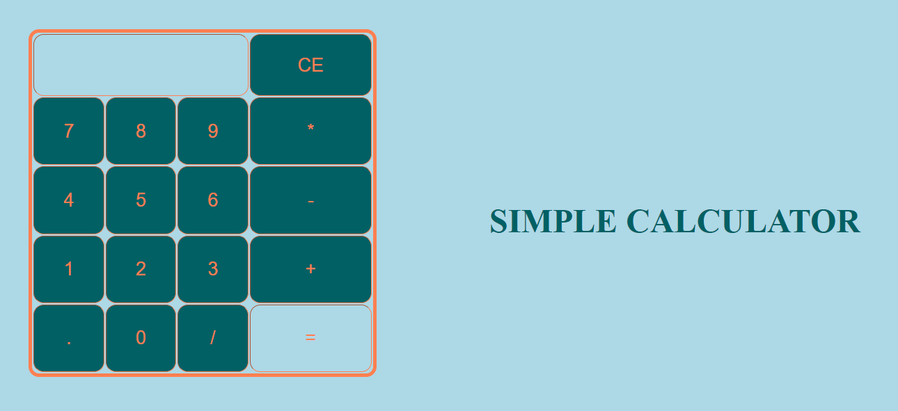

# Simple Calculator

**_By Rosemary Ojwang_**

_An Application that performs simple arithmetic calculations_

## Technologies Used
* JavaScript
* HTML
* CSS

## Description
_The application allow users to perform addition, multiplication, subtraction and division operations on both integers and floating point numbers, and displays the results. If the input of the numbers and operators is not logically correct, an error message is displayed._

## Setup/Installation Requirements
1. _Clone https://github.com/RosemaryOjwang/Simple_Calculator to your desktop._
2. _Navigate to the top level of the directory._
3. _Open [index.html](index.html) in your browser._

## License

[MIT](https://opensource.org/licenses/MIT)

_Copyright (c) 2022._  _**By Rosemary Ojwang**_
